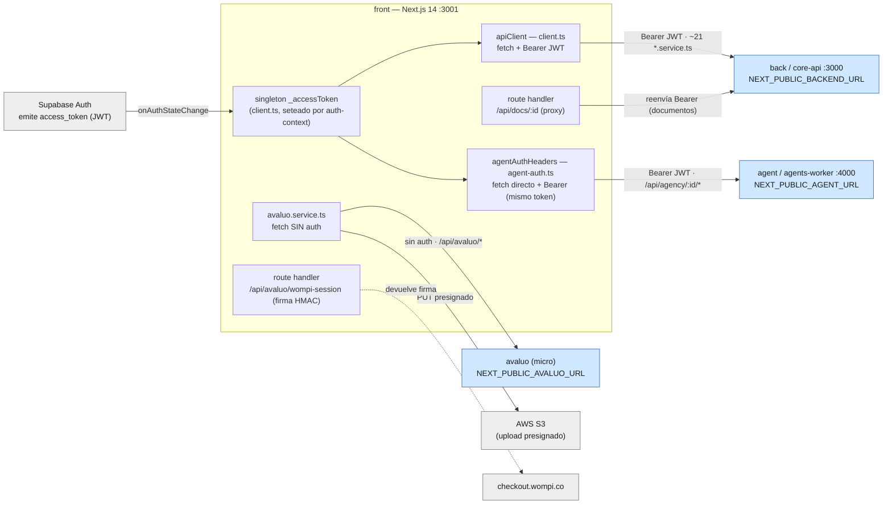

# Mapa de integración del front — back · agent · avaluo

> Cómo el frontend (Next.js 14, :3001) consume cada microservicio. Verificado contra el código
> el 2026-06-23. Para contratos cross-servicio ver `../../SYSTEM-MAP.md`.

## Diagrama

## 1. back (core-api)

| Aspecto | Detalle |
| --- | --- |
| Base URL | `NEXT_PUBLIC_BACKEND_URL` (default `http://localhost:3000`) — leída en `src/lib/api/client.ts:1` |
| Cliente | `apiClient` en `src/lib/api/client.ts` — `fetch` nativo, métodos `get/post/put/patch/delete/getBlob` |
| Auth | Bearer JWT de Supabase. Singleton `_accessToken` seteado por `auth-context.tsx` en `onAuthStateChange`. Sin refresh propio (Supabase lo maneja). |
| Errores | `ApiError(status, message)`. 0 = red/offline, 401 preserva el mensaje del back (distingue "User not found" → onboarding). Sin retry. |
| Servicios | ~21 archivos `src/lib/api/*.service.ts` (applications, contracts, leases, properties, inmobiliaria, subscriptions, notifications, settings, visits, wishlists, messages, recommendations, pse-payments, etc.) |
| Dominios | users, properties, applications/evaluations, contracts (+OTP/firma), leases, inmobiliaria (propietarios/cobros/dispersiones/pipeline/analytics/agency), subscriptions, pse-mock, ai-analysis |
| Proxy | `src/app/api/docs/[documentId]/route.ts` — descarga documentos vía URL firmada de Supabase, reenvía el `Authorization` entrante |

⚠️ **`agent-credits.service.ts` pega al back** (`/agent-credits/*`), no al agent — el nombre confunde.

## 2. agent (agents-worker)

| Aspecto | Detalle |
| --- | --- |
| Base URL | `NEXT_PUBLIC_AGENT_URL` (default `''`, sin fallback) — leída en cada módulo, no centralizada |
| Cliente | NO hay singleton tipo `apiClient`. Cada módulo usa `fetch` directo. Auth centralizada en `src/lib/api/agent-auth.ts` → `agentAuthHeaders()` (lee el mismo `_accessToken`) |
| Auth | Bearer JWT de Supabase (mismo token que el back). Excepciones públicas SIN token: `POST /api/funnel/preaprobacion`, `POST /api/arco` |
| Tipos | Generados con openapi-typescript en `src/lib/api/generated/agent.ts` (~6177 líneas). Regenerar: `pnpm api:gen` (lee `localhost:4000/openapi.json`, fallback `scripts/openapi-snapshot.json`). Frescura: `pnpm api:check` (gate manual, no en CI) |
| Errores | Por módulo, heterogéneo: 404→estado vacío, 503→feature-off, sin URL→error de "no configurado". Sin retry. SSE del chat cae a one-shot si el stream falla |
| Dominios | `/api/agency/:agencyId/*`: ai-hub (chat + SSE, briefing, workspace), cobranza (debtors, calls, wa-templates, pagos), cartera (payment-plans, insurance-claims, legal-artifacts), cotizador, pagos home, experiments, search, ap/bills, my-permissions, members/preferences. Además: `/api/dashboard/*/:agencyId`, `/onboarding/*`, `/terceros/extract`, `/property-capture/extract` |

⚠️ **Mock mode**: NO existe `NEXT_PUBLIC_USE_MOCK_API`. El fallback a mock se activa cuando falta `NEXT_PUBLIC_AGENT_URL` o no hay `agencyId` (`useBetaChat.ts:986`, `isAgentConfigured()` en `ai-hub-chat.ts:298`).

## 3. avaluo (micro)

| Aspecto | Detalle |
| --- | --- |
| Base URL | `NEXT_PUBLIC_AVALUO_URL` (default `undefined`) — leída en `src/lib/api/avaluo.service.ts:23`. Si falta, las páginas degradan a "próximamente" |
| Cliente | `src/lib/api/avaluo.service.ts` — `fetch` directo, **sin token de auth** (micro público/semi-público) |
| Endpoints | `POST /api/avaluo/photo-presign` (URL S3), `PUT <uploadUrl>` directo a S3, `POST /api/avaluo/intake` (form; maneja 429/422/503), `GET /api/avaluo/:id/status` (polling 15s, con mock fallback `{status:'en_revisión'}` si el endpoint no existe) |
| Páginas | `/avaluo` (landing), `/avaluo/nuevo` (wizard 4 pasos), `/avaluo/estado/[submissionId]` (polling + retorno Wompi), `/avaluo/verificar/[slug]` |
| Panel | `/panel/inmobiliaria/inmuebles/avaluos` usa el **agent** (`GET /api/agency/:id/ai-hub/agentes/avaluos/overview`), NO el micro avaluo; el CTA externo linkea a `NEXT_PUBLIC_AVALUO_URL` |

⚠️ **El único route handler de avaluo NO es un proxy al micro.** `src/app/api/avaluo/wompi-session/route.ts` solo computa el HMAC-SHA256 de integridad de Wompi server-side (usa `WOMPI_INTEGRITY_SECRET`/`WOMPI_PUBLIC_KEY`, sin `NEXT_PUBLIC_`) y devuelve la firma; `WompiPayButton.tsx` redirige a `checkout.wompi.co`. Precio hardcodeado: `5_000_000` ($50.000 COP).

## Resumen de auth por servicio

| Servicio | Token | Header | Cliente |
| --- | --- | --- | --- |
| back | Supabase JWT | `Authorization: Bearer` | `apiClient` (centralizado) |
| agent | Supabase JWT (mismo) | `Authorization: Bearer` | `fetch` directo + `agentAuthHeaders()` |
| avaluo | ninguno | — | `fetch` directo en `avaluo.service.ts` |

## Discrepancias detectadas con la doc previa (a corregir)

1. La env var de avaluo es `NEXT_PUBLIC_AVALUO_URL`, no `NEXT_PUBLIC_AVALUO_API_URL`.
2. No existe `NEXT_PUBLIC_USE_MOCK_API`; el mock del agent es por ausencia de `NEXT_PUBLIC_AGENT_URL`.
3. `agent-credits.service.ts` consume el back, no el agent.
